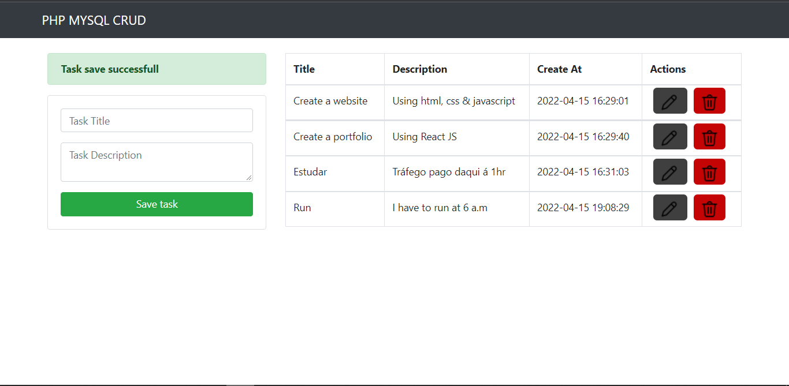

<<<<<<< HEAD

=======
- Theme Name: CRUD - Create Read Update - Delete
- Author: Osvaldo Cariege
- Author URI/Mail: osvaldocariege06@gmail.com
- Version: 1.0

> Projeto Código-Aberto de Sistema de geração de tarefas em PHP

## Qual o principal motivo deste projeto?

Este projeto foi criado por `Osvaldo Cariege` em 04/2022, com o objectivo de aprimorar os meus conhecimentos na linguagem PHP.

Este projeto visa a partilhar um pouco do meu conhecimento e atender exclusivamente aos desenvolvedores iniciantes na área técnica de programação `FullSatck PHP`.

## Ferramentas utlizadas:

    - HTML
    - CSS
    - BOOTSRATP
    - PHP
    - MYSQL

>>>>>>> b8c23ea6777bcaab8c0a012fc8d96fb759c225da

